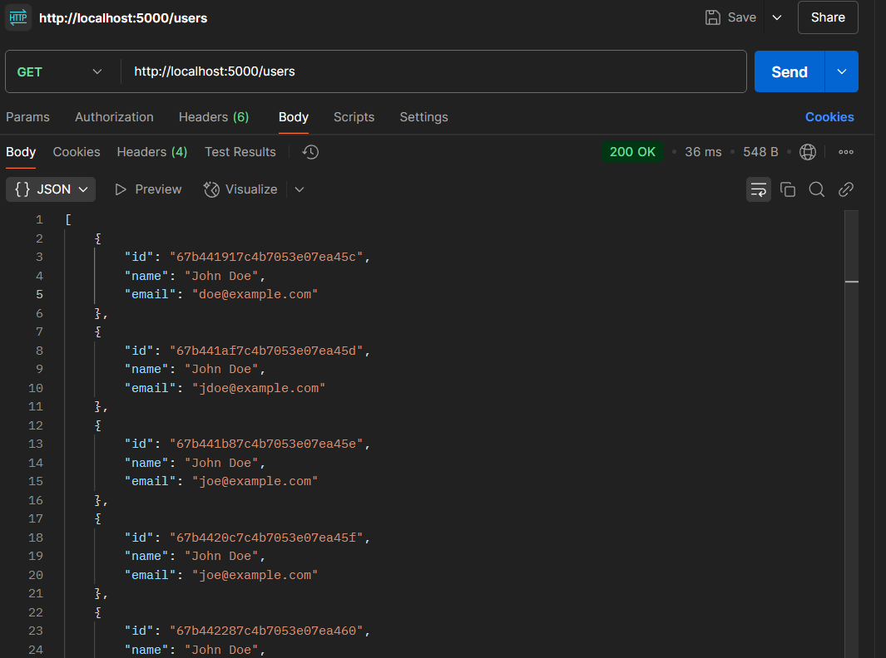
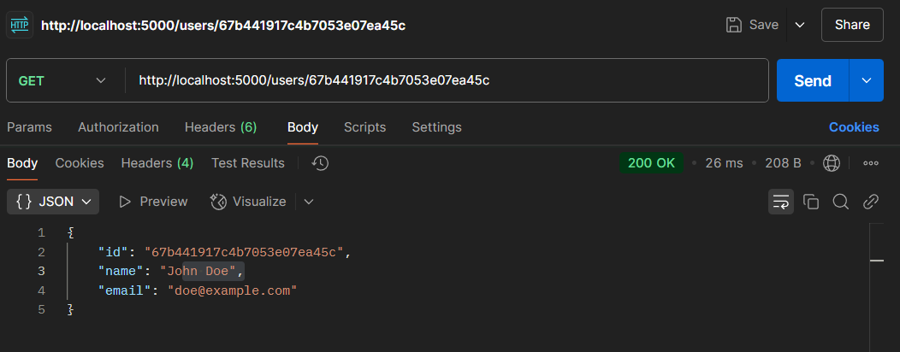
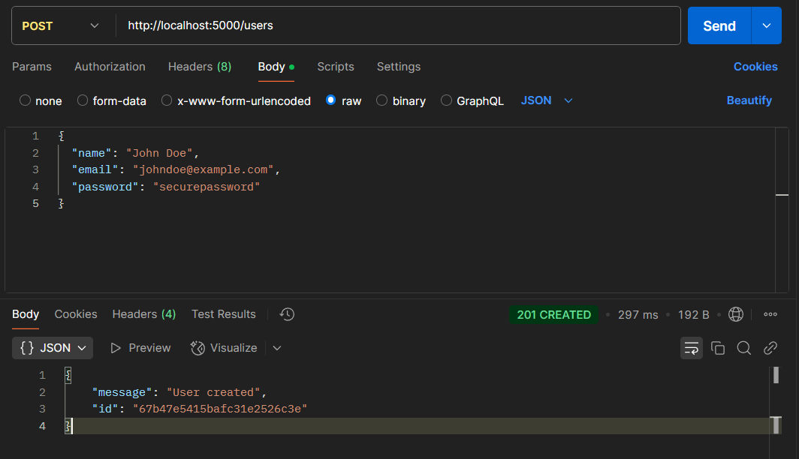
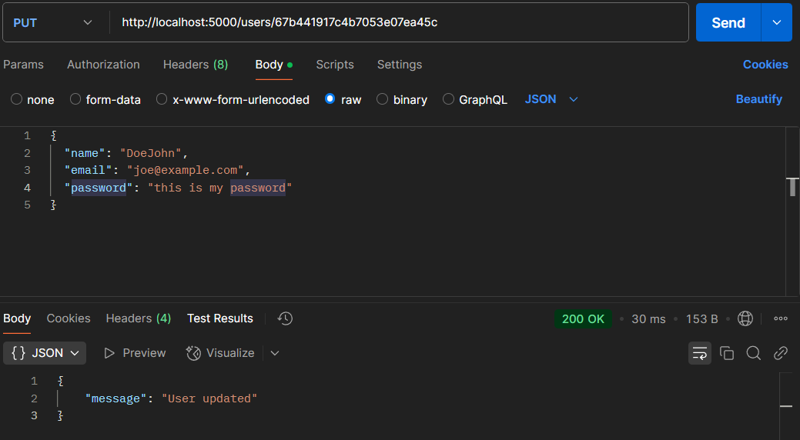
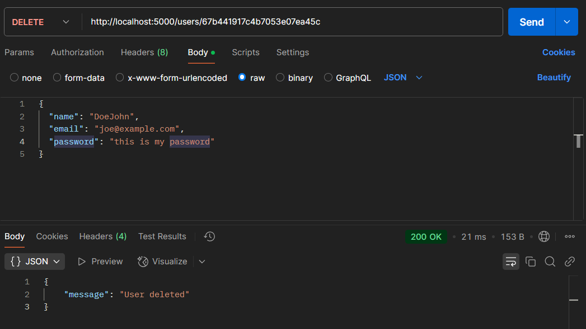
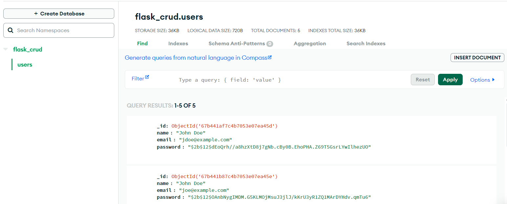
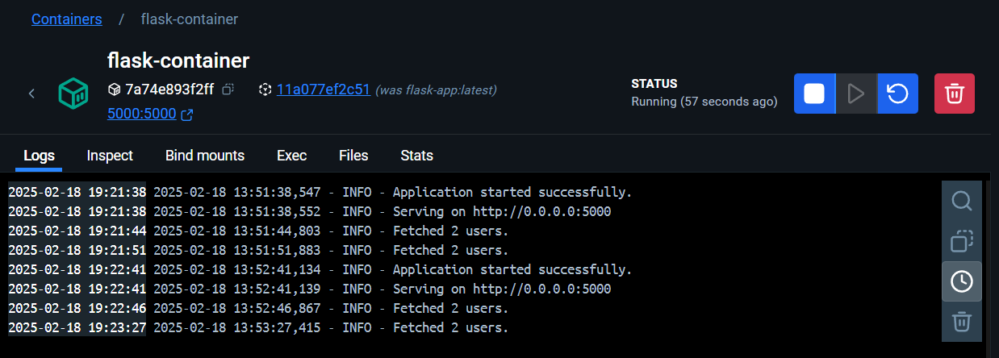

# Flask MongoDB CRUD API

## Features
- **User Management** - Create, read, update, delete users
- **Secure Password Hashing** - Uses `bcrypt` for storing passwords securely
- **Logging & Error Handling** - Uses `logging` to track errors & events

---

## Installation & Setup

### 1. Clone this Repository

### 2. Install Dependencies
```sh
pip install -r requirements.txt
```

### 3. Configure Environment Variables
Create a `.env` (`.env.example`) file in the root directory and add:
```ini
MONGO_URI=
SECRET_KEY=
FLASK_ENV="development"
LOG_FILE="logs/app.log"
```

### 4. Run the Flask Application
```sh
python main.py
```
By default, the API runs at `http://localhost:5000/`.

---

## Docker Support

### 1. Build the Docker Image
```sh
docker build -t flask-app .
```

### 2. Run the Docker Container
```sh
docker run -d -p 5000:5000 --name flask-container flask-app
```

### 3. Stop the Docker Container
```sh
docker stop flask-container
```

### 4. Remove the Docker Container
```sh
docker rm flask-container
```

## API Endpoints

### 1. Get All Users
```http
GET /users
```
**Example:**
```sh
curl -X GET http://localhost:5000/users
```
**Response:**


### 2. Get User by ID
```http
GET /users/{user_id}
```
**Example:**
```sh
curl -X GET http://localhost:5000/users/67b441917c4b7053e07ea45c
```
**Response:**


### 3. Create a New User
```http
POST /users
```
**Request Body:**
```json
{
  "name": "John Doe",
  "email": "johndoe@example.com",
  "password": "secure_password"
}
```
**Response:**


### 4. Update User
```http
PUT /users/{user_id}
```
**Request Body:**
```json
{
  "name": "DoeJohn",
  "email": "joe@example.com",
  "password": "this is my password"
}
```
**Response:**


### 5. Delete User
```http
DELETE /users/{user_id}
```
**Response:**


---

## Proofs
- Data Getting Stored

- Working docker container

## Development & Debugging
### Run Flask App
```sh
python main.py
```
### View Logs
Logs are stored in `logs/app.log`. Check them for debugging issues.
